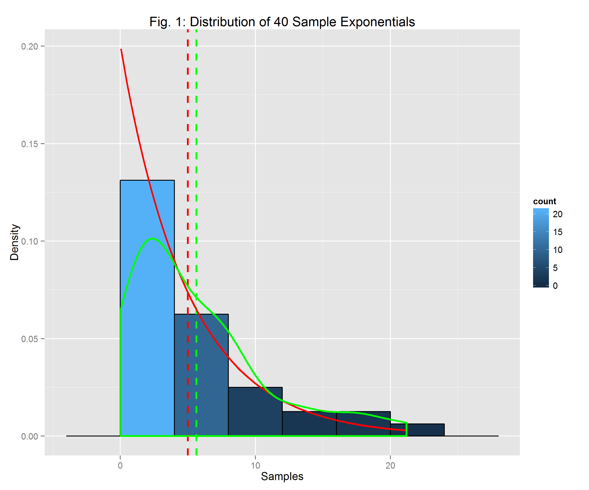
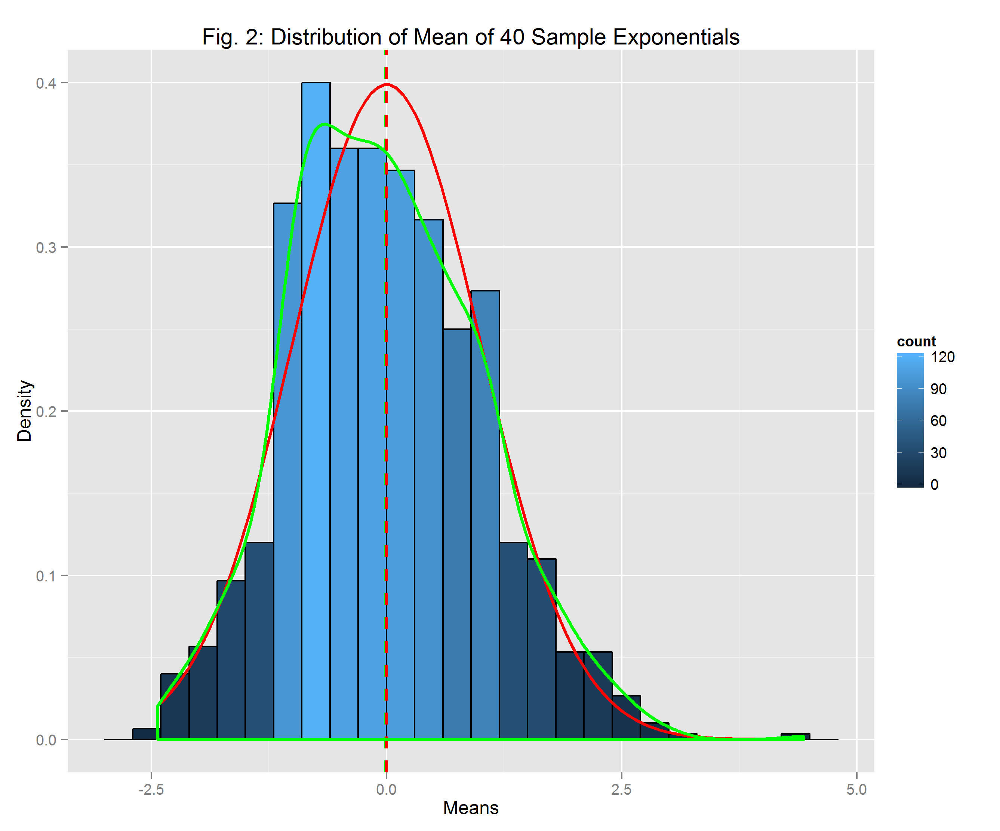

##Investigating the Central Limit Theorem Using the Exponential Distribution

###Overview

This report investigates the Central Limit Theorem, one of the most important theorems in statistics. Through a simulation of exponential random variables, one can see that the distribution of a large number of averages approximates to the normal distribution. This report will verify the normal approximation by comparing the theoretical mean and variance to the sample mean and variance of the simulated exponentials.

###The Exponential Distribution
A simulation of forty exponentials was performed, and Figure 1 shows the results in a histogram. The blue bins make the histogram of the simulated data. The red density curve and dotted line shows the theoretical exponential distribution and mean, while the green density and dotted line shows the experimental smoothed distribution and mean.



Note that the experimental distribution approximates the theoretical exponential distribution, and the experimental mean is close to the theoretical mean.

```
##                     means
## Sample Mean      5.631731
## Theoretical Mean 5.000000
```

###The Central Limit Theorem

#### Simulations

To simulate the Central Limit Theorem, I generated 1000 sets of 40 exponential random variables, and saved the mean of each of those sets in a data frame. I also normalized the means by subtracting the theoretical mean and dividing by the standard error, which helps in plotting the distribution of the averages.

####Distribution
Figure 2 shows the histogram (in blue) of the means of each simulation of forty exponentials. The green smooth line shows the sample distribution based of the averages of the generated exponentials. The red smooth line shows the theoretical standard normal distribution. The green and red distributions are not identical, but have very similar shapes. In comparison, the exponential distribution shown in Figure 1 looks much different that the distribution in Figure 2. Even though the distribution of a large collection of exponential random variables is exponential, the distribution of a large collection of averages of exponential random variables is normal!

 

####Sample Mean versus Theoretical Mean
The green and red dotted lines in Figure 2 show where the sample mean and theoretical mean lie within the sample and theoretical distributions. The green dotted line is difficult to see because it is almost completely overlapped by the red dotted line, showing that the sample and theoretical means are so close. In fact the sample mean is less than 1% off from the theoretical mean. Note that the mean of the simulated averages is approximately the mean of the single run generated earlier.

```
##                 mean variance
## sample      4.991689 0.631064
## theoretical 5.000000 0.625000
```

####Sample Variance versus Theoretical Variance

As shown above, the sample variance is a good estimator of the theoretical variances, as there is less than a 3% difference between the two. Note that the variance of the averages is less than the variance of individual exponentials by a factor of 40 (the number of exponentials generated in each simulation).